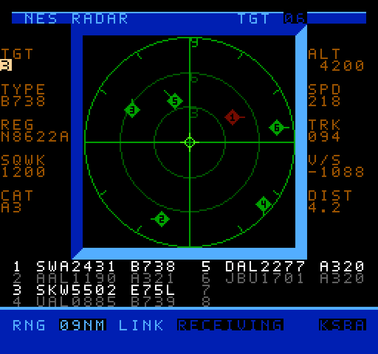
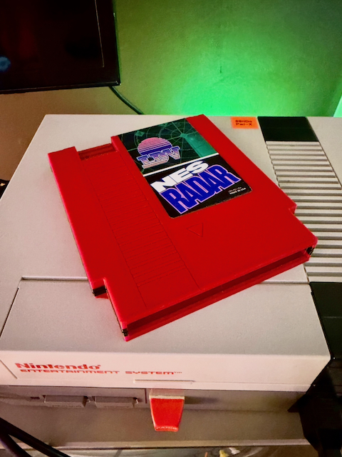

# NES Radar

**NES Radar turns a real Nintendo Entertainment System into a live air traffic scope.**

**This project is in active development. Check back soon for updates and improvements.**

Type any airport's four-letter ICAO code on the NES controller, press Start, and the aircraft actually flying near that airport *right now* appear as moving targets on your TV.

It works for airports worldwide. Point it at your local field and watch the approach traffic line up, or at KLAX and watch it get busy. Watch this quick [video demo](https://youtube.com/shorts/Oe8KoSeiIBw?is=U8YdVTy6Am7p5CTu).



The NES can't reach the Internet, so a small server on your computer fetches live traffic from [adsb.fi](https://adsb.fi) and streams it down the controller cable. The NES sends your airport choice back up the same cable.

This project is based on [c64u-radar](https://github.com/k6lcm/c64u-radar), a similar program for the Commodore 64.

---

## What you need

This is a hardware project, not a download-and-play ROM.

- A real NES and a flash cartridge to load the ROM
- A **5 V FTDI USB serial cable**, wired to controller port 2 (see below)
- **Two** 1 kΩ resistors
- A computer to run the server — on a Mac it's a self-contained binary with nothing to install; Windows and Linux run from Python source
- An Internet connection

An **FT232R-compatible** adapter is what this project is tested against. The server lists every serial device it finds and lets you pick, but other adapters may behave differently, electrically or in timing.

Downloads live on the [Releases page](https://github.com/k6lcm/nes-radar/releases): the ROM, the macOS Universal binary, the Python source archive, and a `SHA256SUMS` file to check them against.

## Wiring

> [!CAUTION]
> Connect your vintage NES to your modern computer **at your own risk**. The authors are not responsible for damage caused by this experimental project.

### Get a 5 V TTL cable

Use a **5 V USB-to-TTL serial cable**. The recommended reproducible part is the genuine [FTDI `TTL-232R-5V-WE`](https://ftdichip.com/products/ttl-232r-5v-we/). Testing has been done with FT232R-compatible adapters at 5 V. Others may work but use at your own risk.

**Do not use a 3.3 V adapter.** Its 3.3 V TX output is not a reliably guaranteed logic high for every 5 V NES input buffer. A genuine FTDI `TTL-232R-3V3` has 5 V-tolerant inputs but it may not drive the NES reliably. The USB ID `0403:6001` identifies the FT232R family; it does **not** tell you whether a cable is 3.3 V or 5 V.

You can use an old controller cable or purchase a new replacement controller cable or controller extension which can be cut to size.

### Connections

With the NES powered off and USB unplugged, connect to **controller port 2**:

| FTDI pin | NES controller port 2 | Connection |
|---|---|---|
| GND | pin 1 — GND | direct |
| RXD | pin 3 — OUT0/LATCH | **through its own 1 kΩ series resistor** |
| TXD | pin 4 — D0 | **through a separate 1 kΩ series resistor** |
| VCC +5V | — | **not connected; insulate** |
| CTS# | — | not connected; insulate |
| RTS# | — | not connected; insulate |

> [!IMPORTANT]
> There are **two separate 1 kΩ resistors**, one in each signal direction. Do not join RXD and TXD together, and do not connect OUT0 to CTS. Insulate the unused VCC, CTS, and RTS leads individually.

Plug a normal controller into **port 1** — that's what you use to enter the airport code.

Full port pinout, **viewed looking into the jack on the front of the console**:

```
               .
pin 1 GND  -- |o\
pin 2 CLK  -- |o o\ -- pin 5 +5V
pin 3 OUT0 -- |o o| -- pin 6 D3
pin 4 D0   -- |o o| -- pin 7 D4
               '--'
```

> **Check your orientation before soldering.** The plug's mating face and its
> wire/solder side are mirrored. Confirm you are counting pins in the direction
> above — not from the back of the connector. See the
> [NESdev controller port pinout](https://www.nesdev.org/wiki/Controller_port_pinout).

> **Double-check pin continuity. Do not rely on wire color alone.** NES
> controller cables all use different colors. Identify NES-side wires by
> continuity and pin number, never by color alone. See the
> [NESdev serial cable page](https://www.nesdev.org/wiki/Serial_Cable_Construction).

A correctly built cable measures about 1 kΩ on each signal and about 2 kΩ through the two-resistor loop.

### Why each line

Both signals run 9,600 baud UART. TXD → D0 carries the radar scenes from the server to the NES. OUT0 → RXD carries your ICAO code and the Select-button pause request back the other way. Each 1 kΩ series resistor limits fault current during a miswire, contention, or the common case where USB is powered while the NES is off. Neither meaningfully affects the signal at 9600 baud.

The NES controller-port input buffer inverts D0, which the ROM corrects in software. The reverse direction needs no inverter: OUT0 high is UART mark, OUT0 low is space.

Leaving either wire disconnected gets you a scope that never accepts an airport.

### Before you power anything on

- **Never connect the red +5 V lead to pin 5.** That puts two independent 5 V supplies against each other and can back-power equipment.
- Use a **TTL UART** cable only. Never connect the NES to true RS-232 signalling apart from GND — those swing to ±12 V and will damage it.
- Insulate every unused lead **separately**, so none can touch ground or another signal.
- Verify continuity, and check for shorts to pin 5, before applying power.
- Power down the NES and unplug USB before assembling or changing any wiring.

This wiring was accepted on an **NTSC** NES. Some PAL consoles have additional protection diodes on the controller port; PAL compatibility is not claimed.

> [!NOTE]
> **Coming from an earlier build?** The cable changed with 0.4.3 — OUT0 now goes to RXD through its own series resistor instead of straight to CTS. Full pinout and upgrade steps are in [`SIGNALING.md`](SIGNALING.md) and [`CHANGELOG.md`](CHANGELOG.md).

## Running the server

### macOS

The macOS build is a self-contained Universal 2 binary — it carries its own Python and pyserial, so there's nothing to install.

Unzip it and start the launcher:

```
cd NES-Radar-0.4.3-macos-universal
./start_nes_radar_server.command
```

You can also just double-click `start_nes_radar_server.command` in Finder.

The build is ad-hoc signed but **not notarized**, so the first launch is blocked with a warning about an unidentified developer. Open **System Settings → Privacy & Security**, find the message about `nes-radar-server`, and click **Open Anyway**. You only do this once — after that the launcher starts normally.

Sanity check before wiring anything up:

```
./start_nes_radar_server.command --self-test
```

Start through the launcher rather than running `nes-radar-server` directly. It passes your arguments straight through, and it keeps you on the copy macOS has already approved.

If you would rather clear the warning up front, this removes the quarantine flag macOS puts on files downloaded from the web:

```
xattr -dr com.apple.quarantine .
```

Do that only after checking your download against `SHA256SUMS`.

### Windows and Linux

There is no prebuilt binary for Windows or Linux — both run from the Python source package, which needs:

- **Python 3.9 or newer**
- **pyserial 3.5** — `pip install -r requirements.txt`

pyserial is what talks to the USB adapter, so the server won't start without it. The macOS binary has it baked in; the source package does not.

```
# Windows
start_nes_radar_server.bat

# Linux
python3 start_nes_radar_server.py
```

Real-hardware acceptance has been done on macOS. Treat Windows and Linux as the experimental path.

## Using it

1. Load the ROM on the NES.
2. Start the server and pick your serial device from the numbered list.
3. Enter an airport ICAO code on the NES and press Start.

**Changing airports.** Press Select on the scope, wait for the ICAO editor, type the next code, press Start. Leave the server running the whole time — a pause handshake keeps the old traffic from scrambling the editor.

**Reading the link.** The `LINK` field shows what the connection is doing.

- `LINK IDLE` — a fresh scene was accepted and the ROM is displaying it. This is the only state that starts sprite-flicker rotation.
- `LINK RECEIVING` — the display window is over and the ROM is listening for the next packet. The controller works here.
- `LINK WAITING` — ten seconds have passed without a valid packet, or the host marked its data stale. The last scene stays on screen; the `LINK` field is what tells you it's old.
- `LINK ERROR 1` … `ERROR 5` — the receiver's reason for rejecting the last packet. Plain unnumbered `LINK ERROR` is different: it means the server accepted a scene but flagged the upstream data as bad. See [`nes_radar/LINK_STATES.md`](nes_radar/LINK_STATES.md) for the meanings.

**If you restart the server** while the ROM is already on the scope or at `LINK WAITING`, reload the ROM before starting a new session.

**If the server is transmitting but the ROM stays at `LINK WAITING`,** check the D0 connection and the common ground. The host can confirm bytes written to the adapter, but it cannot prove the NES received them.

**If the ROM never leaves the airport editor,** check the OUT0 → RXD side — the reverse path. The host can't tell the difference between a NES that isn't sending and a NES that's sending into a disconnected pin.

### Known issue: intermittent LINK ERROR

An intermittent `LINK ERROR` has been seen on hardware. It recovers on its own when the next valid packet arrives — the scope keeps working, and no action is needed. Its cause has not been established; raising `--chunk-gap` from 30 ms to 40 ms did not eliminate it, so insufficient chunk-gap margin was not established as the cause either.

If you see it, the `ERROR` number tells you which check rejected the packet, and a report of the number and what you were doing is genuinely useful.

## Limits

- The scope covers **9 nautical miles** and shows at most **eight aircraft**. More than four markers sharing scanlines use deliberate NES sprite-priority flicker.
- USB detach and reattach mid-session has not completed hardware acceptance.
- The macOS binary is ad-hoc signed, but it is not Developer ID signed or notarized.
- Live traffic needs outbound HTTPS to adsb.fi.
- PAL consoles are not claimed. Windows and Linux hosts are the experimental path.

The README inside the source archive is package-only and links back here for the full picture.

## Repository layout

| Path | What it is |
|---|---|
| [`SIGNALING.md`](SIGNALING.md) | The electrical, timing, framing, packet, and link-ownership contract. |
| [`CHANGELOG.md`](CHANGELOG.md) | Version-by-version summary. |
| `nes_radar/` | The buildable NES ROM source, build files, protocol documentation, and required runtime assets. |
| `server/` | The Python server source, launchers, and native packaging files. |

Prior releases are tagged in git and their downloads are attached to their own [Release entries](https://github.com/k6lcm/nes-radar/releases). [`0.3.1`](https://github.com/k6lcm/nes-radar/tree/0.3.1) is the pulse-width cable and ROM.


